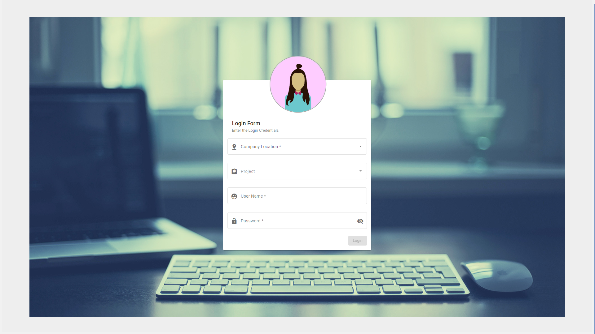

# Advance_Angular_Web_Application
Advance Angular Web Application, is an example on how to use all major functionalities, API and all features of Angular. 

### Features used in the project
This project consists all latest modals and covers the usage of most of the materials components fields, not only restricted to,

* Check Box
* Date Picker
* Form field
* Input 
* Radio Button Select
* Menu 
* Side Nav
* Tool Bar
* Cards
* Devider 
* And more

### Inbuilt Security
This project mainly concentrated on Frond end security, demonstrating how to initilize cookies and use them to maintain standard datas during next logins and erase them all after the session is over for a perticular user.

### Supported OS
Advance Angular Web Application, is developed as platform independent and tested on  __Linux__, __Windows__, __MacOS__ operating system.

RPP is developed for __Linux__ operating system.
### Prerequisites
1. [Node.js](https://nodejs.org/en/)
2. [npm package manager](https://docs.npmjs.com/)
3. [Angular CLI](https://angular.io/guide/setup-local#step-1-install-the-angular-cli)

### Project Development Configurations
1. __Node.js__ - 12.9.0
2. Development __Angular CLI__ - 7.2.3
3. Buid __Angular CLI__ - 9.1.3

### Instructions to setup the project

The project can be built and executed in 3 simple steps. As follows,

1. Clone the repository
```
$ git clone https://github.com/muthu-kumaravel/Advance_Angular_Web_Application.git
```
2. Extract node_modules in the same folder

(or)

2. Build the angular project yourselg
```
$ npm install -g @angular/cli
$ npm install --save @angular/material @angular/cdk
$ npm install --save @angular/animations
$ npm install --save hammerjs
```

3. Serve the project
```
$ ng serve --o
```

### Home page UI design
<p align="center"></p>